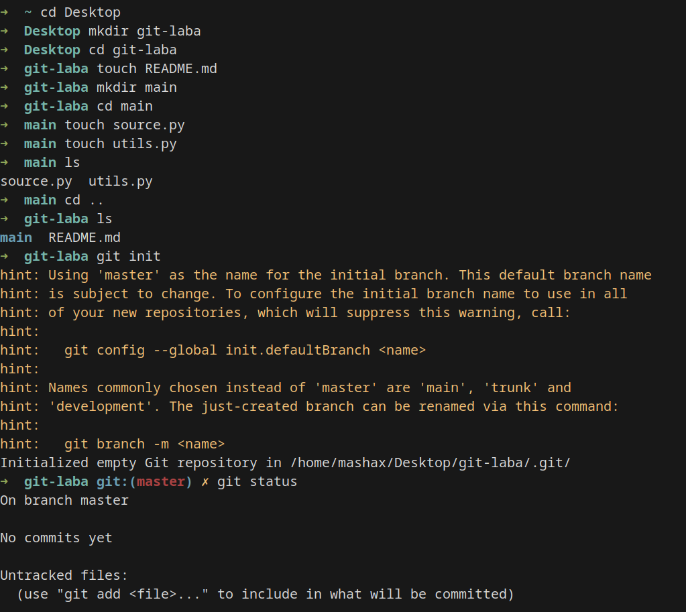
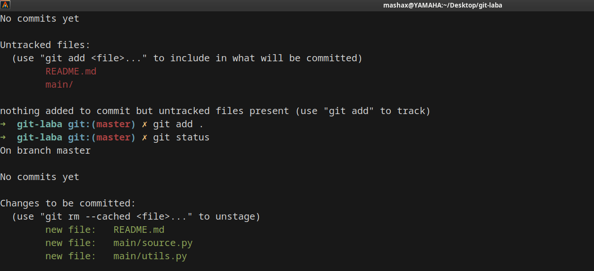
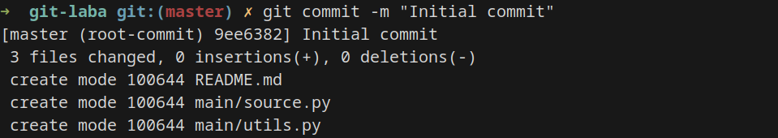
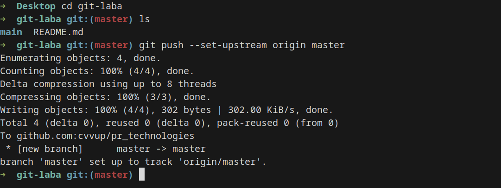

# Работу выполнила

Хайдукова Маша, БИВТ-23-7

Лаба 1 - знакомство с Git'ом 

# Ход работы 

## Создание репозитория 

Первое, что необходимо было сделать, создать папки и файлы, ориентируясь по гиту:

С помощью команды `ls` я удостоверилась, что создала все, что требовалось. Далее для инициализации репозитория я использовала команду `git init`.
После чего посмотрела статус файлов в проекте, использовав команду `git status`.

Далее я добавила все файлы проекта в индекс, чтобы они были добавлены в будущий коммит, с помощью команды `git add .`:

Чтобы удостовериться в наличии сохраненной уже информации о себе, использую команду `git config -l`.

## Создание коммита

Использую команду `git commit`:

## Добавляем новый репозиторий

Теперь надо настроить репозиторий, чтобы можно было выполнять команду `git push`. Самое сложное из всей лабораторной было добавление ssh-ключа, именно из-за него я не могла долго запушить в проект. С помощью предаставленной супер-ссылки и неоднократного обращения к гуглу, получилось добавить ключ в гитхаб.

## Пуш локальных коммитов

Дальше добавила в локальный репозиторий данные об удалённом репозитории при помощи команды `git remote` и запушила:

*Лабораторная выполнена!* Ссылка на репозиторий: https://github.com/cvvup/pr_technologies.git

